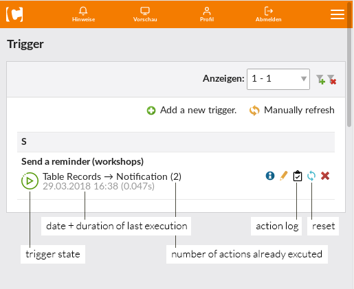

contao-trigger
==============
This bundle adds an extensible **condition ⇒ action** framework to
Contao OpenSource CMS. The condition checking is processed on a regular
basis via a cron job. If one or more actions are executed a respective
entry gets created in the trigger log.

Components
----------

By default the following components are available:

 - **Conditions**
    - **Table Records**: Executes an action at most once for each of a
      selected table's rows if:

      *A)* a *custom expression* based on the table's columns is met
      > category == 'things' and sum_total - coupon 2 > 100

      *B)* a field containing datetime information matches a given
      *time constraint* (e.g. 7 days  later / 15 minutes before). When
      using the latter, the execution time can be overwritten (e.g. 3
      days in advance, but at 6pm).

 - **Actions**
    - **Notification Action**: Allows to send a custom notification via
      `terminal42\notification-center` (must be installed individually).
      The available simple tokens are based on the selected condition
      and are displayed in the backend.
    
    

Installation
------------
 - [Installation / Setup](src/Resources/docs/installing.md)

Extending the framework
-----------------------
 - [Adding conditions & actions](src/Resources/docs/extending.md)